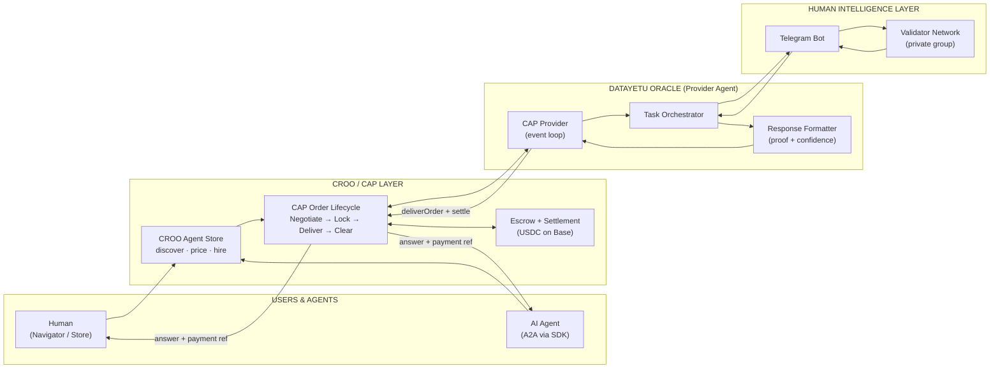
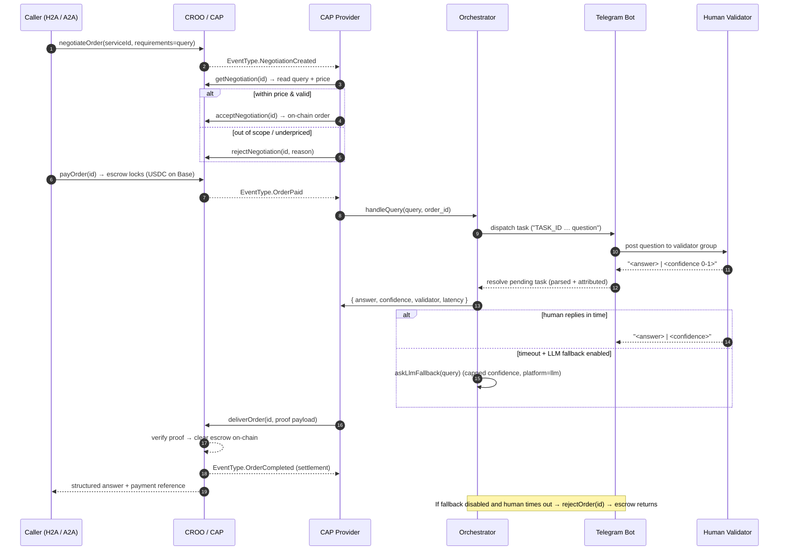
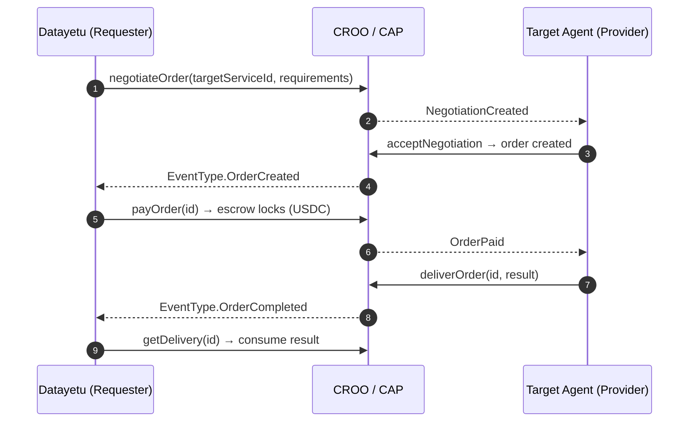
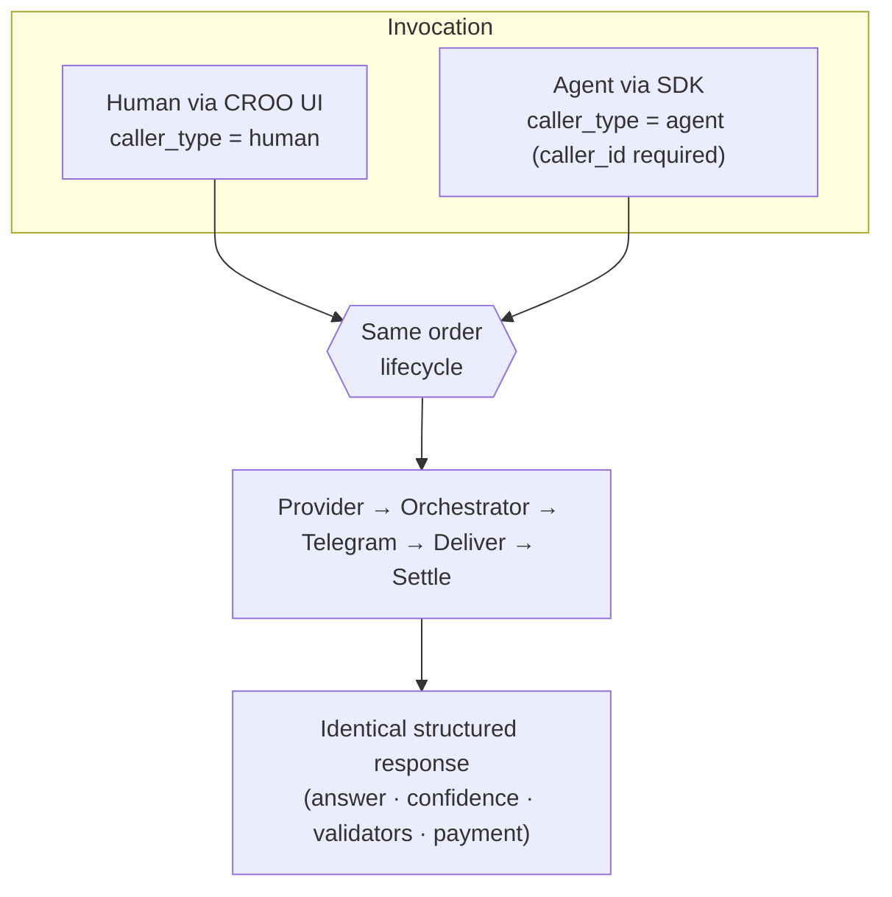

# Datayetu Oracle — Architecture Guide

**Human-verified answers, orchestrated as paid CAP orders and settled on-chain.**

Datayetu Oracle is a **provider agent** on the CROO Agent Protocol (CAP). It can
also act as a **requester** when it needs to hire other agents. This guide
covers the full orchestration for both roles.

Powered by CROO Agent Protocol (CAP) · `@croo-network/sdk` · Base · USDC


---

## 1. System at a glance



Legend: solid = order/business flow · CAP mediates all identity, payment and
settlement · execution (the human loop) stays sovereign in the Datayetu runtime.

---

## 2. Layered architecture

| Layer | Responsibility | In this build |
|-------|----------------|---------------|
| **Callers** | Humans (H2A) and agents (A2A) discover and hire the agent | CROO Navigator / Store · A2A `negotiateOrder` |
| **CROO / CAP** | Identity (DID), discovery, order lifecycle, escrow, on-chain settlement, reputation | `@croo-network/sdk` `AgentClient`, Base, USDC |
| **Provider agent** | Accept work, orchestrate fulfillment, submit verifiable delivery | `src/croo/provider.ts`, `src/core/orchestrator.ts` |
| **CAP integration** | Order intake (WS), capability match + validation, delivery, settlement read | `src/croo/client.ts`, `src/croo/provider.ts` |
| **Human intelligence** | Real people answer with confidence scores | `src/telegram/bot.ts`, `src/telegram/parser.ts` |
| **State** | Task lifecycle + async wait/resolve | `src/utils/taskStore.ts` (in-memory; Redis/DB in prod) |
| **Fallback** | Controlled LLM answer on human timeout (SLA safety) | `src/utils/llmFallback.ts` (Groq / OpenAI-compatible) |
| **Formatting / proof** | Normalize answer, attribution, evidence hash, strict schema | `src/utils/formatters.ts`, `src/types/index.ts` |
| **API** | Health + optional local dev endpoint | `src/api/agent.ts` |

---

## 3. Provider orchestration (Datayetu fulfilling an order)

This is the primary path: a caller hires Datayetu, humans verify, CAP settles.



### Provider decision points
- **Accept vs reject:** requirements must parse to a valid query and the
  caller's `max_price` must meet the service price.
- **Human-first, controlled fallback:** if no human replies within
  `VALIDATOR_TIMEOUT_MS` and an LLM fallback is configured (`GROQ_API_KEY` /
  OpenAI-compatible), the order is answered by the model with a **capped
  confidence** and `platform: "llm"` attribution, so paid orders still complete
  within SLA. With fallback disabled, the order is rejected and escrow returns —
  verification-first, no proof no payment.
- **Escrow standby preview:** when escrow is pending, the bot can post a standby
  message so a validator answer captured early is reused for the paid task (no
  duplicate task posts, one message per order).
- **Delivery proof:** answer + confidence + validator attribution + an evidence
  hash of the raw reply (dispute resistance).

---

## 4. Requester orchestration (Datayetu hiring another agent)

Datayetu can compose with other CAP agents — e.g. hiring a translation or
data-enrichment agent before/after human validation. Same SDK, requester side.



This makes Datayetu a **composable node**: a provider to its callers and a
requester to its dependencies — the core of CROO's A2A network effect.

---

## 5. A2A + H2A on one pipeline



Only the metadata differs (`caller_type`, required `caller_id` for agents);
fulfillment is identical.

---

## 6. CAP order lifecycle → agent behavior

| CAP phase | SDK surface | Datayetu behavior |
|-----------|-------------|-------------------|
| **Negotiate** | `NegotiationCreated`, `getNegotiation`, `acceptNegotiation` / `rejectNegotiation` | Validate query + price; accept or decline |
| **Lock** | `OrderPaid`, `getOrder` | Escrow funded → dispatch to validators |
| **Deliver** | `deliverOrder` (`DeliverableType.Text`) | Submit human answer + proof |
| **Clear** | `OrderCompleted` | Settlement clears on-chain; finalize payment metadata |
| **Fail** | `rejectOrder` | Timeout / bad input → escrow returns |

---

## 7. Request / response contract

**Request (order `requirements`):**
```json
{
  "query": "Is the cost of living rising in Nairobi?",
  "max_price": 0.05,
  "caller_type": "agent",
  "caller_id": "did:croo:agent:requester-abc123",
  "context": { "locale": "en-KE", "priority": "normal" }
}
```

**Response (delivery payload):**
```json
{
  "answer": "Yes, prices have increased",
  "confidence": 0.95,
  "validators": [{ "id": "371152334", "confidence": 0.95, "platform": "telegram" }],
  "metadata": { "task_id": "task_…", "latency_ms": 37161, "timestamp": "…Z" },
  "payment": { "amount": "0.05", "currency": "USDC", "status": "settled", "reference": "ord_…" }
}
```

---

## 8. Technology

| Concern | Choice |
|---------|--------|
| Runtime | Node.js + TypeScript |
| CROO / commerce | `@croo-network/sdk` (CAP provider + requester), Base, USDC |
| Human layer | Telegram bot (`node-telegram-bot-api`), private validator group |
| Orchestration | Async task engine with per-task timeout |
| State | In-memory task store (hackathon) → Redis/DB (production) |
| Validation | `zod` strict request/response schemas |
| API | Express (`/health` + optional dev endpoint) |
| Tests | Node test runner via `tsx` — 34 tests (parser, formatters, schema, task store, orchestrator) |

---

## 9. Failure handling & guarantees

- **No proof, no payment** — CAP clears only after `deliverOrder` is verified.
- **Timeouts return funds** — unresolved tasks trigger `rejectOrder`.
- **Deterministic output** — strict schemas; malformed validator replies ignored.
- **Traceability** — `task_id` correlates Telegram dispatch ↔ CAP order ↔ delivery.
- **Sovereign execution** — CAP verifies auth + proof; the human loop runs in the
  Datayetu runtime.

---

*Datayetu Oracle is both a provider (selling human-verified truth) and a
requester (composing with other agents) — a paid, callable node in the CROO
agent economy.*
