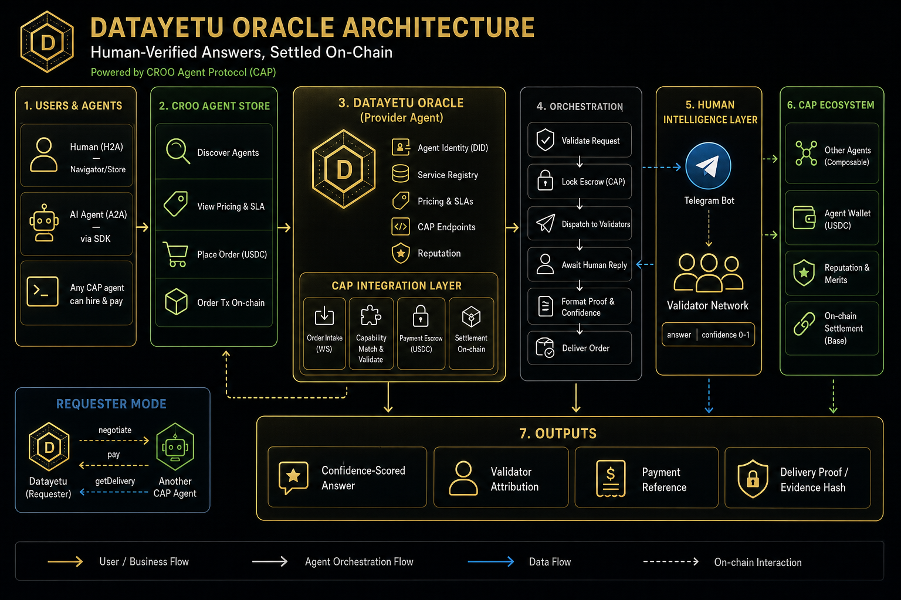

# Datayetu Oracle — CROO Agent

**Buy human-verified answers to real-world questions. Confidence-scored,
on-chain, agent-callable.**

Datayetu Oracle is a **CROO-native oracle agent**. It sources real-world answers
from a **Telegram human-validator network**, returns a **structured,
confidence-scored** result, and settles payment **on-chain via the CROO Agent
Protocol (CAP)** — never through manual wallet transfers.

- **A2A + H2A**: callable programmatically by other agents *and* by humans via
  the CROO Navigator / Agent Store — one fulfillment pipeline.
- **Human-grounded, with SLA safety**: every answer comes from a real validator
  with a confidence score; an optional, **controlled LLM fallback** (capped
  confidence, `platform: "llm"`) keeps paid orders inside SLA if humans time out.
- **CAP-settled**: `Negotiate → Lock → Deliver → Clear`; payment metadata is
  derived from CAP events and settlement tx, not fabricated.

**Docs:** [Architecture guide](ARCHITECTURE.md) · [Demo runbook](DEMO.md)

## Architecture



See the full **[Architecture guide](ARCHITECTURE.md)** for provider + requester
sequence diagrams and the CAP lifecycle mapping.

```
CROO caller (H2A / A2A)
   │  negotiate + pay (CAP escrow, USDC on Base)
   ▼
CrooProvider ──► Orchestrator ──► ValidatorBot ──► Telegram group
   ▲                                   │   (human reply, or LLM fallback on timeout)
   │        validated answer           ▼
   └──── deliverOrder (proof) ◄── Orchestrator (normalize + attribute)
   │
   ▼
CAP verify → clear → on-chain settlement
```

| Path | Module |
|------|--------|
| CAP event loop (provider + requester) | `src/croo/provider.ts`, `src/croo/client.ts` |
| Core engine | `src/core/orchestrator.ts` |
| Human validation | `src/telegram/bot.ts`, `src/telegram/parser.ts` |
| LLM fallback (SLA safety) | `src/utils/llmFallback.ts` |
| Async wait + task state | `src/utils/taskStore.ts` |
| Response shaping + proof | `src/utils/formatters.ts` |
| Schemas / types | `src/types/index.ts` |
| HTTP (health + dev) | `src/api/agent.ts` |
| A2A requester (demo/tests) | `scripts/a2a-requester.ts` (`npm run a2a`) |

## Prerequisites

1. **CROO Dashboard** — create the agent, register a service, and issue an
   SDK-Key. Fund the agent **AA wallet** with USDC on Base.
   - Service **input schema** should match the request schema in the spec.
   - Service **output schema** should match the delivery payload in
     `buildDeliveryPayload` (`src/utils/formatters.ts`).
2. **Telegram** — create a bot via [@BotFather](https://t.me/BotFather), add it
   to a private validator group with message-reading enabled, and note the
   group chat id.
3. **Node.js 18+**.

## Setup

```bash
cd agent
npm install
cp .env.example .env   # fill in CROO + Telegram values
```

## Run

```bash
npm run dev      # tsx watch (development)
# or
npm run build && npm start
```

On boot the agent:
1. starts the Telegram validator bot,
2. connects to CAP and listens for negotiations/orders,
3. exposes `GET /health` (and `POST /agent/query` if `ENABLE_DEV_ENDPOINT=true`).

## Deploy 24/7 (production)

This agent is a long-running worker process (not a serverless function). For
always-on runtime, deploy it as a persistent container on any worker-friendly
platform (Railway, Render background worker, Fly.io, Cloud Run jobs with
continuous process, VPS + systemd, etc.).

### Build and run with Docker

```bash
cd agent
docker build -t datayetu-agent .
docker run --env-file .env --name datayetu-agent --restart unless-stopped datayetu-agent
```

### Recommended: Docker Compose (24/7 with healthcheck)

```bash
cd agent
docker compose up -d --build
docker compose ps
docker compose logs -f
```

Update / restart:

```bash
cd agent
docker compose pull || true
docker compose up -d --build
```

Required runtime env vars:
- `CROO_API_URL`
- `CROO_WS_URL`
- `CROO_SDK_KEY`
- `CROO_SERVICE_ID`
- `TELEGRAM_BOT_TOKEN`
- `TELEGRAM_GROUP_ID`
- `SERVICE_PRICE`
- `SERVICE_CURRENCY`
- `VALIDATOR_TIMEOUT_MS`
- `BASE_RPC_URL` (optional)

Production notes:
- Keep exactly one active runtime per `CROO_SDK_KEY` (CROO allows one active WS connection per key).
- Fund the agent AA wallet with USDC on Base before accepting paid orders.
- Use process restarts/health checks from your host for resilience.
- For real 24/7 availability, run this on an always-on host (VPS or cloud worker), not your laptop.

### CI/CD (GitHub Actions → ECS, no local Docker)

Deploy remotely on every push to `main` (or manually via **Actions → Deploy Agent (prod)**).

**One-time setup**

1. In GitHub repo **Settings → Secrets and variables → Actions**:
   - **Secrets:** `AWS_ACCESS_KEY_ID`, `AWS_SECRET_ACCESS_KEY`, `CROO_SDK_KEY`, `TELEGRAM_BOT_TOKEN`, plus `CROO_API_URL`, `CROO_WS_URL`, `CROO_SERVICE_ID`, `TELEGRAM_GROUP_ID`
   - **Variables:** `ECS_SUBNETS`, `ECS_TASK_SG`, `ECS_EXECUTION_ROLE_ARN`, `ECS_TASK_ROLE_ARN` (same values as DataYetu API infra)
2. Run workflow **Sync Agent Secrets (AWS)** once — copies runtime secrets into AWS Secrets Manager (`datayetu/prod/agent`).
3. Push to `main` — workflow builds the Docker image on GitHub runners, pushes to ECR, and updates ECS service `datayetu-agent-prod`.

**Manual deploy from laptop (optional)**

```bash
chmod +x scripts/deploy-ecs.sh
SKIP_SECRET_UPLOAD=1 IMAGE_TAG=$(git rev-parse HEAD) \
  ECS_SUBNETS=subnet-xxx,subnet-yyy ECS_TASK_SG=sg-xxx \
  ECS_EXECUTION_ROLE_ARN=arn:aws:iam::... ECS_TASK_ROLE_ARN=arn:aws:iam::... \
  ./scripts/deploy-ecs.sh
```

## Order lifecycle

| CAP event | Agent action |
|-----------|--------------|
| `NegotiationCreated` | Validate `requirements`, check price, `acceptNegotiation` (or `acceptNegotiationWithFundAddress` if the service requires fund transfer) |
| `OrderPaid` | Dispatch query to Telegram, await human validator, `deliverOrder` |
| human timeout | If LLM fallback configured → answer via model (capped confidence, `platform: "llm"`) and `deliverOrder`; else `rejectOrder` (escrow returns) |
| `OrderCompleted` | Settlement cleared on-chain; finalize payment metadata |
| bad input / dispatch failure | `rejectOrder` with reason |

Requesters send the query as the order **`requirements`** JSON string, e.g.:

```json
{
  "query": "Is the cost of living rising in Nairobi?",
  "max_price": 0.05,
  "caller_type": "agent",
  "caller_id": "did:croo:agent:requester-abc123"
}
```

## CAP SDK methods used

Built on [`@croo-network/sdk`](https://github.com/CROO-Network/node-sdk)
(`AgentClient`). Methods exercised by this agent:

| Method / API | Where | Purpose |
|--------------|-------|---------|
| `new AgentClient(config, sdkKey)` | `src/croo/client.ts` | Authenticated CAP runtime client (SDK-Key) |
| `connectWebSocket()` | `src/croo/provider.ts` | Real-time order event stream |
| `EventType.NegotiationCreated` | `src/croo/provider.ts` | Trigger to evaluate + accept work |
| `getNegotiation(negotiationId)` | `src/croo/provider.ts` | Read `requirements` (the query payload) |
| `acceptNegotiation(negotiationId)` | `src/croo/provider.ts` | Accept terms → create on-chain order |
| `rejectNegotiation(id, reason)` | `src/croo/provider.ts` | Decline out-of-scope / underpriced work |
| `EventType.OrderPaid` | `src/croo/provider.ts` | Escrow funded → begin fulfillment |
| `getOrder(orderId)` | `src/croo/provider.ts` | Recover query context if negotiation event missed |
| `deliverOrder(orderId, req)` | `src/croo/provider.ts` | Submit verifiable delivery (`DeliverableType.Text`) |
| `rejectOrder(orderId, reason)` | `src/croo/provider.ts` | Fail gracefully on timeout / error |
| `EventType.OrderCompleted` | `src/croo/provider.ts` | Settlement cleared on-chain |

## Integration notes

- **Settlement is CAP-native.** Payment is escrowed on order lock and released
  by the protocol after `deliverOrder`; the agent never sends manual wallet
  transfers. Delivery/settlement tx hashes come from CAP results and events.
- **The deliverable is the answer.** The requester reads the structured oracle
  response via `getDelivery(orderId)`; the payload shape is produced by
  `buildDeliveryPayload` (`src/utils/formatters.ts`) and includes answer,
  confidence, validator attribution, latency, and an evidence hash of the raw
  human reply for dispute resistance.
- **A2A + H2A on one path.** Both human (via CROO Navigator / Store) and agent
  (via `negotiateOrder`) callers converge on the same order lifecycle;
  `caller_id` is required for agent callers.
- **Wallet funding.** Before accepting paid orders, deposit USDC to the agent's
  **AA wallet** (shown in the CROO Dashboard) — not the controller address.
- **Chain.** CAP settles on Base; the SDK defaults to Base mainnet RPC unless
  `BASE_RPC_URL` is set.
- **Human layer stays sovereign.** Execution (the Telegram validator loop) runs
  in this runtime; CAP verifies auth + proof only.

## Validator reply format

Validators must **reply to the bot's task message** using:

```
<answer> | <confidence 0-1>
```

Example: `Yes, prices have increased significantly | 0.9`

## Local testing (no CAP)

Set `ENABLE_DEV_ENDPOINT=true`, then:

```bash
curl -X POST http://localhost:3000/agent/query \
  -H 'content-type: application/json' \
  -d '{"query":"Is the cost of living rising in Nairobi?","max_price":0.05,"caller_type":"human"}'
```

This exercises the Telegram loop and returns a structured response with
`payment.status: "pending"` (real settlement requires the CAP path).

## A2A: call the agent from another agent (real on-chain order)

`scripts/a2a-requester.ts` acts as a second CROO agent that negotiates, pays,
and reads the delivery — proving A2A composability end-to-end.

```bash
# Requires a SECOND CROO agent (requester) SDK-Key with a funded USDC AA wallet
# on Base, set in .env (see script header for the exact vars it reads).
cd agent
npm run a2a -- "Is maize flour price up in Nairobi this week?"
```

Flow: `negotiateOrder → payOrder → OrderCompleted → getDelivery` — printed as
the structured oracle response. Use a distinct requester key (≠ provider key)
and pass a real question.

## Testing strategy (recommended)

1. **Local CAP-connected test first**  
   Run `npm run build && npm start` (or Docker locally), then place a real CROO
   order against your service from Navigator/requester. This validates
   negotiation, pay, deliver, and settlement end-to-end with easier debugging.

2. **Then test in production runtime**  
   After deploying 24/7, place another paid order and verify logs + CROO order
   completion. This confirms your hosted runtime remains stable.

## Tests

Pure-logic and orchestration tests run with the built-in Node test runner (no
external services needed) via `tsx`:

```bash
npm test              # run all tests
npm run typecheck     # typecheck src
npm run typecheck:test # typecheck src + tests
```

Coverage:

| Suite | What it dry-runs |
|-------|------------------|
| `tests/parser.test.ts` | Validator reply parsing, TASK_ID extraction, message formatting |
| `tests/formatters.test.ts` | Confidence clamping, answer normalization, success/error/delivery payloads |
| `tests/schema.test.ts` | Request validation, A2A `caller_id` rule, strict `context` |
| `tests/taskStore.test.ts` | Async wait/resolve and timeout of the pending-task registry |
| `tests/orchestrator.test.ts` | End-to-end dispatch → validate → result, timeout and dispatch-failure paths (with a fake bot) |

The orchestrator tests exercise the full engine loop without CROO or Telegram,
so you can dry-run behavior and catch regressions as the code changes.

## Environment variables

See [`.env.example`](.env.example).

## License

MIT — see [`LICENSE`](LICENSE).
